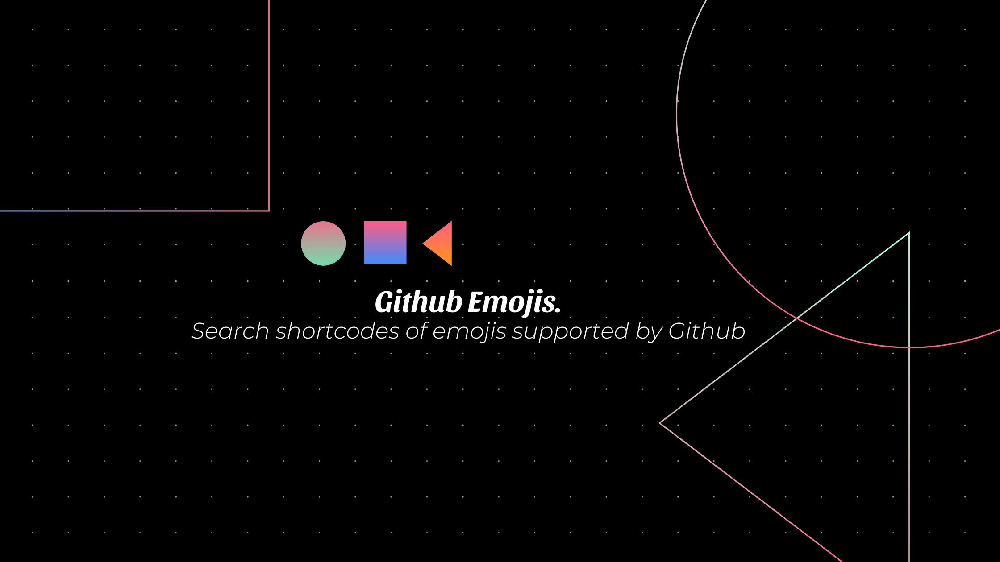

<h1 align="center">
  
   
  Github Emojis
</h1>

  
  
  
  
  
  
  
  

---

## Motivation 💪
I often use emojis in my github commit messages, and only very few of them (because I usually forget the names), now there are many awesome gists which provide an entire list of all emojis supported by Github like [rxaviers](https://gist.github.com/rxaviers/7360908) and [roachhd](https://gist.github.com/roachhd/1f029bd4b50b8a524f3c) etc.

However as it loads the entire emoji list right of the bat, it takes up too much time to load the page and not really easy to search while loading, so I thought of creating a small project to solve this problem that I was facing.

## Tech Stack 💻

* [Next.js](https://nextjs.org/)
* [Chakra UI](https://chakra-ui.com/)
* [Typescript](https://www.typescriptlang.org/)
* [FaunaDB](https://fauna.com/)
* [Vercel For Deployment](https://vercel.com)

## Features ✨

* Lazy Loading Emojis from [Github Emoji API](https://developer.github.com/v3/emojis/) using [Intersection Observer API](https://developer.mozilla.org/en-US/docs/Web/API/Intersection_Observer_API) :grimacing:
* Search Feature with debounce :incoming_envelope:
* Dark / Light theme switcher :yin_yang:
* Minimalistic and smooth UI :atom_symbol:
* PWA Enabled :zap:

## Support 💵
> If you found this project helpful or you learned something from the source code and want to thank me, consider buying me a cup of :coffee:

## Bugs or Requests 🐛

If you encounter any problems feel free to open an [issue](https://github.com/AkashRajpurohit/github-emojis/issues/new?template=bug_report.md). If you feel the project is missing a feature, please raise a [ticket](https://github.com/AkashRajpurohit/github-emojis/issues/new?template=feature_request.md) on GitHub and I'll look into it. Pull request are also welcome.

## Where to find me? 👦🏽
* [Website](https://akashrajpurohit.cf/)
* [Linkedin](https://www.linkedin.com/in/AkashRajpurohit)
* [Instagram](https://www.instagram.com/akashwho.codes)
* [Twitter](https://www.twitter.com/AkashWhoCodes)
